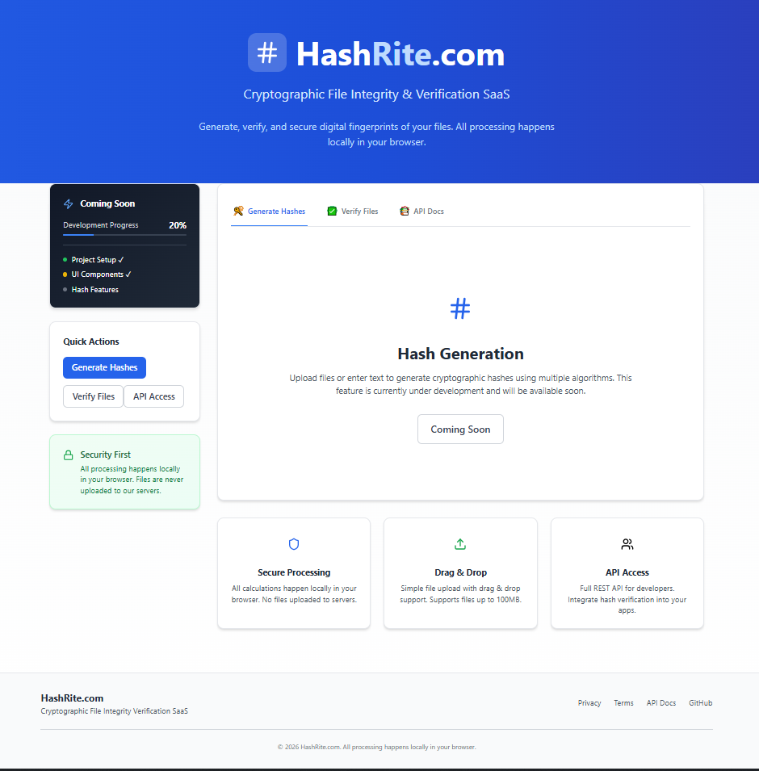

# 🔐 HashRite.com
### Cryptographic File Integrity & Verification SaaS

Generate, verify, and secure digital fingerprints of your files — **locally, privately, and securely**.

---

## 🚀 Live Demo
👉 **https://hashrite.com**

---

## 📸 Screenshots

  
*Modern, clean interface for cryptographic operations*

---

## ✨ Features

### 🔒 Security First
- 100% local processing in your browser  
- Files are **never uploaded** to servers  
- Zero data retention policy  
- Privacy-by-design architecture  

---

### 📁 Flexible Input
- Drag & drop file uploads  
- Direct text input for instant hashing  
- Supports **all file types**  
- Up to **100MB** file size  

---

### 🔧 Supported Hash Algorithms
- **MD5** — Legacy compatibility  
- **SHA-1** — Standard hashing  
- **SHA-256** — Recommended & secure  
- **SHA-512** — Maximum security  

---

### 📤 Export Options
- Copy individual hashes to clipboard  
- Download all results as **JSON**  
- Plain text export for documentation  
- Verification IDs for future reference  

---

## 🚧 Coming Soon

### 🔄 File Verification
- Batch verification for multiple files  
- Historical verification records  

---

### ⚡ Advanced Features
- **Batch Processing** — Hash multiple files at once  
- **API Access** — REST endpoints for developers  
- **Browser Extensions** — Chrome & Firefox add-ons  
- **CLI Tool** — Command-line interface  

---

### 📊 Enhanced Experience
- **History & Bookmarks** — Save frequently used hashes  
- **Team Collaboration** — Shared hash libraries  
- **Advanced Algorithms** — SHA3, BLAKE2 support  
- **Mobile App** — iOS & Android applications  

---

### 🏢 Enterprise Features
- **Audit Logging** — Compliance-ready tracking  
- **SSO Integration** — Enterprise authentication  
- **API Rate Limiting** — Production-ready scaling  
- **Custom Domains** — Branded deployments  

---

## 🎯 Use Cases

### 👨‍💻 For Developers
- Verify downloaded packages and dependencies  
- Check file integrity after transfers  
- Generate hashes for documentation  

### 🏢 For Businesses
- Maintain audit trails for critical documents  
- Comply with data integrity regulations  
- Validate supply chain security  

### 👤 For Everyone
- Check downloaded files for tampering  
- Verify backup integrity  
- Learn cryptography through hands-on usage  

---

Made with 🔒 for the security-conscious community.  

**HashRite.com — Trust, but verify. With cryptography.**
